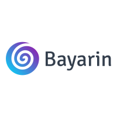

## About Bayarin

Bayarin is an SPP (Education Development Contribution) system designed to make it easier for mankind to pay tuition fees.

## Contributing

Thank you for considering contributing to the Bayarin! The contribution guide can be found in the [Bayarin documentation].

## Code of Conduct

In order to ensure that the Laravel community is welcoming to all, please review and abide by the [Code of Conduct].

## Security Vulnerabilities

If you discover a security vulnerability within Bayarin, please send an e-mail to Chacha Nurholis via [chachanurholis29@gmail.com](mailto:chachanurolis29@gmail.com). All security vulnerabilities will be promptly addressed.

## Developer

<a href="https://github.com/chanurholis">Chacha Nurholis</a>

## License

The Bayarin is open-sourced software licensed under the [MIT license].
